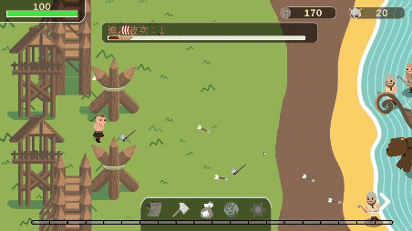
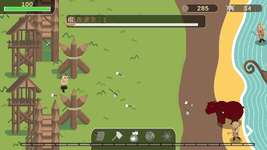
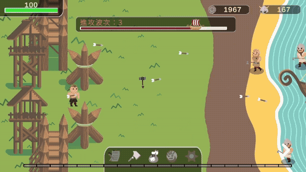
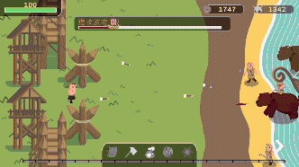

# 🛡️ 塔防2D遊戲

## 🎮 遊戲介紹

本遊戲參考「迴旋鏢老兄」的玩法設計，屬於橫向塔防類遊戲，適用於 PC 與 PE 平台。

---

## 🕹️ 遊戲玩法

- 遊戲採取橫向塔防設計
- 波次系統：玩家在達成每波目標後，可從三個技能中選擇一項
- 新增升級頁面，方便玩家強化角色或防禦設施

---

▲ 🕹️ 開始動畫  

▲ ⚔️ 攻擊展示  

▲ 🎯 選技能展示  

▲ 🗡️ 選武器展示  

▲ 🎰 抽獎展示

---

## 👹 敵人波次範例

- 新手教學：敵人 ×3，船 ×1
- 第1波：敵人 ×10，船 ×1
- 第2波：敵人 ×20，船 ×2
- 第3波：敵人 ×10，穿裝 ×1，船 ×1
- 第4波：敵人 ×10，穿裝 ×5，船 ×2
- 後續會陸續加入更多敵人與 Boss

（註：一船約10人，數量以四捨五入計算）

---

## 🛡️ 技能列表

| 中文名稱       | 英文名稱                   |
| -------------- | -------------------------- |
| 💰 一袋金幣       | BagOfGoldCoins             |
| 🪓 斧頭愛好者     | AxeEnthusiast              |
| 💖 仁慈的愛神     | MercifulLoveDeity          |
| 👑 神后的預視     | QueenGoddessVision         |
| 🔨 槌子狂熱       | HammerFrenzy               |
| 👁️ 眾神之眼       | EyeOfTheGods               |
| 🔥 火與詭計與混亂 | FireTrickeryChaos          |
| 👑 神王的加護     | DivineKing'sBlessing       |
| 🌅 諸神黃昏       | TwilightoftheGods          |
| 🌾 豐收女神的恩賜 | BountyoftheGoddess         |
| 💰 一小袋金幣     | SmallBagofGoldCoins        |
| ❄️ 暴風雪         | Blizzard                   |
| ⚔️ 戰神之勇       | ValoroftheWarGod           |
| ⚡ 雷霆之力       | PowerofThunder             |

---

## 👨‍💻 製作團隊

| 負責項目     | 成員   |
|--------------|--------|
| 👨‍💻 遊戲程式     | 林其鈺 |
| 🎨 遊戲美術     | 黃韋樺 |

